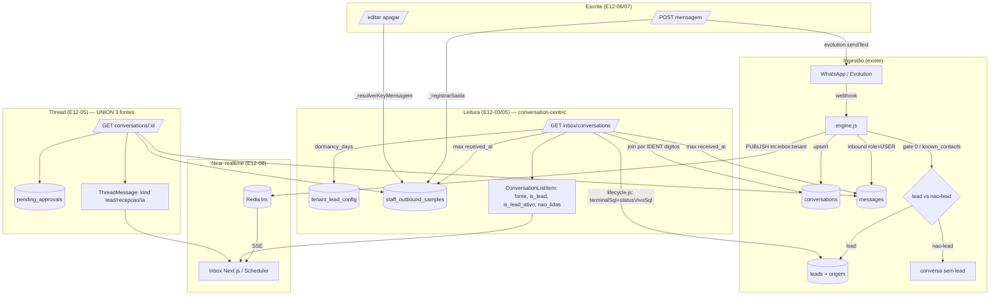

# ARC-042 — Contrato de Dados da Fase 1 (Inbox "Regente" / Épico E12)

- **Status:** PROPOSTO (contrato para CORE/LOGIC + NEON implementarem)
- **Data:** 2026-07-28
- **Autor:** ARC (Arquiteto Técnico — FORGE)
- **Escopo:** fecha o **contrato de dados e de API** da Fase 1 do [ADR-042](ADR-042-central-mensagens-inbox-disparo.md) (backlog [E12](../backlog-adr-042-mensagens.md)). NÃO inclui a migration final nem a UI — entrega o shape, a estratégia de projeção, os endpoints, o near-realtime e a sequência.
- **Ancorado em:** `src/lifecycle.js` (régua ADR-041), `src/stages.js`, `src/db.js` (`withTenant`), `src/routes/tenant.js` (timeline real, envio/editar/apagar), migrations 002/004/010/015/030/043/055/056/062/063–066.

> **Premissa travada (NOVA):** UI Fase 1 = **fluxo único**. Todas as conversas diretas WhatsApp (lead + não-lead) numa lista só, com filtros (Todas · Leads · Não-lead · por fonte). "Lead" é **flag/pill**, não aba.

---

## 0. TL;DR das 5 decisões

1. **Shape** — dois contratos: `ConversationListItem` (item da lista) e `ThreadMessage` (bolha da thread). Ambos **conversation-centric**, não lead-centric.
2. **Projeção `é lead ativo` + `fonte`** — **cálculo no endpoint compondo os fragmentos SQL de `lifecycle.js`** (não VIEW hand-copy, não coluna materializada). Motivo decisivo: **dormência flipa com o relógio, sem evento de escrita** → qualquer materialização nasce stale.
3. **Endpoints** — `GET /:tenantId/inbox/conversations` (lista, filtros, keyset), `GET .../conversations/:conversationId` (thread), `POST .../mensagem` · `.../mensagem/:mid/editar` · `.../mensagem/:mid/apagar` · `.../marcar-lido`. Mesmo padrão de `tenant.js` (`authenticate` + `requireTenantAccess`).
4. **Near-realtime** — **SSE + Redis pub/sub `lm:inbox:<tenant>`**. Sem broker novo, unidirecional (que é exatamente a necessidade), reconecta sozinho. Polling como fallback.
5. **Sequência** — `E12-01→02→03→04→05→06` entrega o marco "recepção responde WhatsApp no Regente"; `07→08→09→10` refinam. **Caminho crítico: E12-03** (a API de listagem destrava toda a UI).

---

## 1. Achados do código real (fundamentam o contrato)

Antes de decidir, a inspeção mudou premissas do ADR-042. **Discrepâncias que CORE/LOGIC precisam saber:**

### D-1 · Não existe FK conversa↔lead — o vínculo é por **dígitos do telefone/psid**
`conversations` (migr. 002) tem `(tenant_id, channel, external_id)`; `leads` tem `phone`/`meta_psid`. Todo o código casa por normalização de dígitos:
```sql
regexp_replace(cv.external_id, '[^0-9]', '', 'g')
  = regexp_replace(coalesce(l.phone, l.meta_psid, ''), '[^0-9]', '', 'g')
```
(ver `tenant.js` linhas 858–860, 903, 1505). **O inbox herda essa chave de casamento** (`ident` = dígitos). Risco baixo, mas real: um `phone` e um `meta_psid` com os mesmos dígitos colidiriam — na Fase 1 (só WhatsApp) é inócuo.

### D-2 · A thread é **UNION de 3 fontes** — outbound NÃO está em `messages`
A bolha da conversa é montada de:
- **`messages`** (`role='USER'`) → entrada do lead/contato (`kind='lead'`).
- **`staff_outbound_samples`** → resposta REAL da recepção/API (`kind='recepcao'`). **É aqui que o outbound vive**, não em `messages`. `messages.direction='outbound'` existe mas tem `external_message_id` NULL em 100% das linhas e **não entra na timeline** (ver migr. 062, cabeçalho).
- **`pending_approvals`** (status `APPROVED`/`EDITED`) → resposta da IA enviada (`kind='ia'`), deduplicada por corpo contra o eco em `staff_outbound_samples`.

A query canônica dessa união já existe em `tenant.js` (linhas 892–1009). **O inbox reusa essa lógica**, só troca a âncora de `lead_id` para `conversation_id`/`ident`.

### D-3 · `é lead ativo` (ADR-041) ≠ o gate (`bolaGate`/`known_contacts`)
O ADR-042 §5 fala em projetar "é lead ativo … **sem reprocessar o gate na UI**". São **dois conceitos distintos** e o texto os confunde:
- **Gate** (Portão 0, migr. 004/055) = decide **lead vs não-lead** (contato conhecido/interno). Isso vira a **flag `is_lead`** (pill "LEAD").
- **Lead ativo** (ADR-041, `lifecycle.js`) = ciclo de vida de um lead que **já é lead**: `STATUS_VIVO ∧ ¬TERMINAL ∧ não-dormente`. Isso é o **refinamento `is_lead_ativo`**.

O contrato separa os dois campos (`is_lead` e `is_lead_ativo`) para não colar conceitos que o código trata separado.

### D-4 · `é lead ativo` **NÃO é trivialmente projetável** de uma linha de `leads`
Da régua ADR-041 (`lifecycle.js`):
- `TERMINAL` e `STATUS_VIVO` saem de colunas de `leads` (`status`, `desfecho`) → triviais.
- **`não-dormente` NÃO sai de `leads`.** Dormência = "última interação ≤ `dormancy_days` do tenant" (migr. 056; `tenant_lead_config.dormancy_days`). O **timestamp da última interação** é derivado por subquery sobre `messages`/`staff_outbound_samples` (ver o cálculo de retomada em `tenant.js` 697–783). **Não há coluna `last_activity_at` em `leads`.**
- **Consequência-chave:** a dormência **muda só com a passagem do tempo** (um lead vira dormente às 00:00 do 8º dia sem nenhuma escrita). Isso **mata a opção de coluna materializada** (§2).

### D-5 · `fonte` de não-lead não vem de `leads.origem`
`leads.origem` (migr. 043, imutável first-touch) **só existe para quem é lead**. Conversa de não-lead não tem linha em `leads` → sem `origem`. Logo:
```
fonte = COALESCE(leads.origem, conversations.channel)
```
Na Fase 1 (só WhatsApp direto) ambos convergem para `whatsapp`, mas o contrato já fica correto para as fases Meta.

### D-6 · `não-lidas` é **estado NOVO** — não existe no schema hoje
Não há **nenhum** rastreio de "lido pela recepção". `ack_status` (migr. 062) é o **check de entrega do NOSSO outbound** (✓/✓✓/✓✓ lido do destinatário), **não** "a recepção leu o inbound". Grep por `last_read|read_at|unread` = zero. **`nao_lidas` exige nova coluna/tabela** (ver §5, ponto de atenção).

### D-7 · `conversations.updated_at` = último **inbound**, não última atividade
O upsert do inbound faz `ON CONFLICT … DO UPDATE SET updated_at = now()` (`engine.js` 378). Mas **outbound (`staff_outbound_samples`) não toca `conversations`**. Então `updated_at` reflete o último inbound, não a última atividade geral. Para ordenar a lista estilo WhatsApp-Web (última mensagem de qualquer lado), **`last_activity_at` deve ser `max(received_at)` sobre as duas fontes** — não confie em `conversations.updated_at`.

### D-8 · Nome do contato não-lead é best-effort
`known_contacts` (migr. 004) **não tem coluna `name`** (só `phone`, `type`, `source`). O nome de um não-lead vem do `pushName` (`messages.sender` / `staff_outbound_samples.sender`). Contrato: `contato.nome = COALESCE(leads.name, pushName, external_id)`.

---

## 2. Decisão — projeção de `is_lead` / `is_lead_ativo` / `fonte`

**Opções avaliadas:**

| Opção | Frescor | Custo leitura | Fonte única (ADR-041) | Veredito |
|---|---|---|---|---|
| **Coluna materializada** em `leads`/`conversations` | ❌ nasce stale: **dormência flipa pelo relógio** (D-4), exigiria cron diário recomputando tudo | ⭐ leitura barata | fork da régua | **Rejeitada** |
| **VIEW SQL** hand-escrita | ✅ real-time | média (join por dígitos + subquery de atividade) | ❌ **copia** o predicado de `lifecycle.js` → viola o invariante "SQL≡JS" do ADR-041 | **Rejeitada** (a menos que gerada dos fragmentos) |
| **Cálculo no endpoint compondo fragmentos de `lifecycle.js`** | ✅ real-time | média (mesmo join; volume pequeno — Valinhos ~54 ativos) | ✅ **reusa** `terminalSql`/`statusVivoSql` — zero cópia, o itest SQL≡JS continua guardando | ✅ **RECOMENDADA** |

**Recomendação: cálculo no endpoint, interpolando os fragmentos SQL canônicos de `src/lifecycle.js`** — exatamente como `metrics.js` já faz. Isso mantém o invariante do ADR-041 (uma definição, provada por itest) e dá frescor real-time (crítico para dormência, que é função do tempo).

Fragmentos a reusar (já exportados por `lifecycle.js`):
- `terminalSql(a)` → `(a.status IN ('CONVERTED','WON') OR a.desfecho IS NOT NULL)`
- `statusVivoSql(a)` → `a.status IN ('NEW','QUALIFYING','QUALIFIED','EXPERIMENTAL_AGENDADA')`

Projeção dos três campos (pseudo-SQL, `l` = lead casado por `ident`, `cv` = conversation):
```sql
-- is_lead: existe lead casável NÃO-descartado (inverso da régua de "Descartados", tenant.js:470)
(l.id IS NOT NULL
   AND NOT (l.status = 'NOT_LEAD')
   AND NOT (l.status = 'REVIEW_QUEUE'))                       AS is_lead,

-- is_lead_ativo: ADR-041 = STATUS_VIVO ∧ ¬TERMINAL ∧ não-dormente
(  statusVivoSql('l')
   AND NOT terminalSql('l')
   AND last_activity_at >= now() - (cfg.dormancy_days || ' days')::interval
)                                                             AS is_lead_ativo,   -- NULL quando is_lead=false

-- fonte: origem imutável do lead, senão canal da conversa (D-5)
COALESCE(l.origem, cv.channel)                                AS fonte
```
`last_activity_at` = subquery `max(received_at)` sobre `messages` (role USER) ∪ `staff_outbound_samples`, casadas por `ident` (D-7). `cfg.dormancy_days` = `tenant_lead_config.dormancy_days` (fallback 7, como em `tenant.js:688`).

> **Ergonomia opcional:** se a equipe quiser uma VIEW por conveniência de leitura, ela deve ser **gerada a partir dos fragmentos de `lifecycle.js`** no passo de build/migration (não hand-copy) e coberta pelo mesmo itest SQL≡JS. Default recomendado: endpoint compute — mais simples e sem nova superfície de drift.

---

## 3. Shapes canônicos (Fase 1)

### 3.1 `ConversationListItem` (item da lista unificada)
```jsonc
{
  "conversation_id": "uuid",          // âncora estável do item (conversations.id)
  "channel": "whatsapp",              // conversations.channel (Fase 1: sempre whatsapp)
  "external_id": "+55...",            // phone/remoteJid (ou meta_psid nas fases Meta)
  "ident": "55...",                   // dígitos — chave de casamento (D-1)

  "fonte": "whatsapp",                // COALESCE(leads.origem, conversations.channel) (D-5)
  "is_lead": true,                    // flag do pill LEAD — gate, NÃO ciclo de vida (D-3)
  "is_lead_ativo": true,              // ADR-041; null quando is_lead=false (D-3/D-4)
  "lead_id": "uuid|null",             // deep-link Inbox↔telas de Lead (E12-09)
  "lead_status": "QUALIFYING|null",   // opcional, p/ detalhar o pill
  "desfecho": "string|null",          // opcional, p/ detalhar terminal/perdido/cliente

  "contato": {
    "nome": "COALESCE(leads.name, pushName, external_id)",   // D-8
    "phone": "+55...|null",
    "meta_psid": "string|null"
  },

  "ultima_mensagem": {
    "preview": "texto ~80c ou '[mídia]' / '🚫 apagada'",
    "kind": "lead|recepcao|ia",       // quem falou por último
    "received_at": "timestamptz",
    "media_type": "string|null",
    "edited_at": "timestamptz|null",
    "deleted_at": "timestamptz|null"
  },

  "last_activity_at": "timestamptz",  // max(received_at) das 2 fontes (D-7) — chave de ordenação
  "nao_lidas": 0                      // ESTADO NOVO (D-6): inbound após o cursor de leitura
}
```

### 3.2 `ThreadMessage` (bolha da thread) — reusa a timeline existente (`tenant.js` 1012+)
```jsonc
{
  "id": "uuid",                       // id da linha na sua fonte (messages | staff_outbound | pending_approvals)
  "kind": "lead|recepcao|ia",         // lead=inbound; recepcao/ia=outbound
  "direction": "inbound|outbound",    // derivado de kind
  "sender": "string|null",            // pushName / role
  "body": "string|null",              // UI substitui por frase quando deleted_at != null
  "received_at": "timestamptz",

  "media_url": "string|null",
  "media_type": "string|null",
  "media_filename": "string|null",
  "media_transcription": "string|null",

  "reactions": ["👍", ...] ,          // ADR-031 item 3 (array_agg)
  "ack_status": "sent|delivered|read|null",  // só outbound (migr. 062); null no inbound
  "edited_at": "timestamptz|null",    // migr. 063 (inbound) / 066 (outbound)
  "deleted_at": "timestamptz|null",   // migr. 064 (inbound) / 065 (outbound)

  "reply_to": {                       // citação; null se não cita
    "id": "uuid",
    "author": "lead|staff",           // USER=lead; ASSISTANT/recepção=staff
    "preview": "~80c ou '[mídia]'"
  }
}
```

**Regra de editável/apagável (herda `_resolverKeyMensagem`, `tenant.js`:1194):** só bolhas outbound (`kind ∈ {recepcao, ia}`) com `external_message_id` (id da Evolution) são editáveis/apagáveis. Bolha `lead` (inbound) → nunca (a UI não oferece a ação; o backend retorna 404 `nao_editavel`/`nao_apagavel`).

---

## 4. Endpoints REST (Fase 1)

Prefixo e middlewares idênticos ao `tenant.js`: `router.<m>('/:tenantId/inbox/...', authenticate, requireTenantAccess(ROLES), ...)`, tudo sob `withTenant(req.tenantId, ...)` (RLS por `SET LOCAL app.current_tenant`).

| # | Método · Path | Query / Body | Retorno | Reuso |
|---|---|---|---|---|
| E12-03 | **GET** `/:tenantId/inbox/conversations` | `?view=todas\|leads\|nao_lead` · `fonte=whatsapp\|...` · `q=<busca nome/telefone>` · `cursor=<opaco>` · `limit=<=50` | `{ items: ConversationListItem[], next_cursor }` | fragmentos `lifecycle.js` + join por `ident` |
| E12-05 | **GET** `/:tenantId/inbox/conversations/:conversationId` | `?before=<cursor>&limit=` (paginação da thread, opcional) | `{ conversation: <header ConversationListItem>, timeline: ThreadMessage[], next_before }` | query da timeline `tenant.js` 892–1009 |
| E12-06 | **POST** `/:tenantId/inbox/conversations/:conversationId/mensagem` | `{ text, reply_to_message_id? }` | `{ ok, message_id, quoted }` | `evolution.sendText` + `_registrarSaida` (`tenant.js`:1224) |
| E12-07 | **POST** `.../:conversationId/mensagem/:mid/editar` | `{ text }` | `{ ok, body }` | `_resolverKeyMensagem` + `evolution.editMessage` (`tenant.js`:1451) |
| E12-07 | **POST** `.../:conversationId/mensagem/:mid/apagar` | — | `{ ok }` | `_resolverKeyMensagem` + `evolution.deleteMessage` (`tenant.js`:1421) |
| E12-08 | **POST** `.../:conversationId/marcar-lido` | `{ up_to?: timestamptz }` | `{ ok, nao_lidas: 0 }` | **NOVO** (cursor de leitura, D-6) |
| E12-08 | **GET** `/:tenantId/inbox/stream` (SSE) | `?since=<cursor>` | `text/event-stream` | Redis `lm:inbox:<tenant>` (§5) |

**Notas de contrato:**
- **Chave do recurso = `conversation_id`**, não `lead_id` (mudança arquitetural — hoje tudo é lead-centric). O `lead_id` viaja no payload para o deep-link (E12-09), mas a URL é da conversa. Isso permite abrir conversa de **não-lead** (que não tem `lead_id`).
- **Paginação = keyset (cursor opaco)**, não offset. `cursor` = base64 de `(last_activity_at, conversation_id)`. Motivo: lista muda em tempo real (WhatsApp-Web); offset duplica/pula itens sob inserção concorrente. `limit` teto 50 (default 30).
- **Envio reusa o caminho WhatsApp** (`evolution.sendText` → `_registrarSaida` em `staff_outbound_samples`); o eco `fromMe` do webhook deduplica por `external_message_id`. **Fase 1 é só WhatsApp**; o `mensagem-meta` (`tenant.js`:1492) fica para E16.
- **`view=nao_lead`** = conversas sem lead ativo/casável OU com lead `NOT_LEAD`/`REVIEW_QUEUE` (inverso de `is_lead`). **`view=leads`** = `is_lead=true`. **`view=todas`** = tudo. `fonte` é ortogonal a `view` (compõem com AND).

---

## 5. Near-realtime (E12-08): SSE + Redis pub/sub

**Decisão: SSE (Server-Sent Events) com fan-out por Redis pub/sub `lm:inbox:<tenant>`.** Sem broker novo.

| Opção | Infra nova | Ajuste ao problema | Veredito |
|---|---|---|---|
| **Polling** (GET lista a cada N s) | nenhuma | simples, mas latência + carga constante mesmo parado | fallback |
| **WebSocket** | upgrade HTTP, lib WS, sticky sessions | bidirecional — **overkill** (envio já é POST comum) | rejeitado |
| **SSE + Redis pub/sub** | **nenhuma** (Redis `lm:` já existe) | unidirecional server→client = exatamente a necessidade; reconecta nativo; passa em proxy | **RECOMENDADO** |

**Fluxo:**
```
webhook (engine.js grava inbound)
   └─► PUBLISH lm:inbox:<tenant>  { conversation_id, ident, kind, preview, at }
GET /:tenantId/inbox/stream  (SSE, aberto pela UI)
   └─► SUBSCRIBE lm:inbox:<tenant>  ──► event: 'conversation.updated' → UI faz refresh do item/thread
```
- **Multi-instância:** Redis pub/sub faz o fan-out entre instâncias Node → qualquer réplica que segure o SSE recebe o evento. ✅
- **Payload leve** (só ids + preview): o cliente decide se recarrega o item da lista ou a thread aberta. Evita vazar corpo por um canal sem contexto RLS.
- **RLS:** o `PUBLISH` roda no webhook, já dentro do tenant. O SSE resolve o tenant pelo `authenticate`/`requireTenantAccess` e assina **só** `lm:inbox:<tenant>` — isolamento por nome de canal. Qualquer leitura de DB dentro do handler SSE usa `withTenant`.
- **Escala:** uma conexão SSE por inbox aberto; no volume atual (poucas recepções por tenant) é trivial. Se crescer, um heartbeat + TTL de conexão.
- **Fallback:** se o browser/proxy não suportar SSE, a UI cai em polling da lista (E12-03) a cada ~10s.

---

## 6. Diagrama — componentes e fluxo



---

## 7. Sequência de implementação (E12) e o corte do marco

```
E12-01  Rebranding rota/nav Descartados→Mensagens            [P, NEON]        (independente)
E12-02  Shell 3 painéis (layout responsivo)                  [M, NEON]        ← 01
E12-03  API listagem unificada (fonte + is_lead + ativo)     [G, CORE·LOGIC] ← CAMINHO CRÍTICO
E12-04  Sidebar: badge fonte, pill LEAD, busca, filtros      [G, NEON]       ← 02,03
E12-05  Thread central (UNION 3 fontes, editada/apagada)     [G, NEON]       ← 02  (query já existe)
E12-06  Enviar mensagem humana via Z-API                     [G, BRIDGE·CORE] ← 05  ┐
────────────────────────────────────────────────────────────────────────────────  │ MARCO
        ► "recepção responde qualquer conversa WhatsApp no Regente" (entrega valor sozinho)
E12-07  Editar/apagar pela UI (reusa 063–066)                [M, NEON·BRIDGE] ← 05,06
E12-08  Near-realtime SSE + coluna de nao-lidas              [M, BRIDGE·NEON] ← 04,05
E12-09  Deep-link Inbox↔telas de Lead                        [M, NEON]        ← 04
E12-10  RBAC (quem envia/apaga) + auditoria                  [M, SHIELD]      ← 06
```

**Dependências duras:**
- **E12-03 destrava tudo** — é onde a projeção `is_lead`/`is_lead_ativo`/`fonte` e o join por `ident` são resolvidos. Prioridade 1 de CORE·LOGIC.
- **E12-05** pode andar **em paralelo** a 03/04 (a query da timeline já existe em `tenant.js`; só re-ancorar em `conversation_id`).
- **Marco = 01→02→03→04→05→06.** Editar/apagar (07), realtime (08), deep-link (09) e RBAC/auditoria (10) são refinamentos pós-marco.
- **E12-08 traz uma migration nova** (a única de dados da Fase 1): coluna/tabela de **cursor de leitura** para `nao_lidas` (D-6). Próximo número livre: **080** (após 079). Sugestão de shape mínimo: `conversations.last_read_at timestamptz` (por conversa; `nao_lidas = count(inbound WHERE received_at > last_read_at)`), aditiva, RLS herdada. **CORE decide** coluna-na-conversa vs tabela de cursor por-operador (se "lido" for por usuário e não por tenant, precisa de tabela `(conversation_id, user_id, last_read_at)`).

---

## 8. Pontos de atenção de RLS / isolamento

1. **Tudo sob `withTenant`** — nenhuma query do inbox roda fora do `SET LOCAL app.current_tenant`. As policies `tenant_isolation` cobrem `conversations`, `messages`, `staff_outbound_samples`, `pending_approvals`, `leads`, `known_contacts`, `tenant_lead_config` (todas com ENABLE+FORCE RLS). O join por `ident` é intra-tenant (cada tabela filtra sozinha) — **não vaza** entre tenants.
2. **SSE não pode furar RLS** — o canal Redis `lm:inbox:<tenant>` isola por nome; qualquer leitura de DB no handler SSE **precisa** de `withTenant`. Nunca publicar corpo de mensagem no evento (só ids + preview curto), para não expor dado por um caminho sem contexto de tenant.
3. **Colisão de `ident`** (D-1) — teoricamente um `phone` e um `meta_psid` de dígitos iguais no mesmo tenant se casariam. Fase 1 (só WhatsApp) é imune; sinalizar para E16 (omnichannel) resolver junto com a dedup de pessoa (ADR-007 §2.4).
4. **`marcar-lido` e a nova coluna** — a migration 080 herda RLS da tabela-alvo; se for tabela de cursor por-usuário, ela precisa da própria policy `tenant_isolation` (ENABLE+FORCE) no mesmo padrão.
5. **Escopo D1** — a UI vive no Next.js do Scheduler; a autorização de editar o Scheduler é **escopada a esta feature** (ADR-042 D1). Nada de tocar o Scheduler fora do inbox.

---

## 9. Próximos passos concretos

1. **CORE·LOGIC** implementam **E12-03** reusando `lifecycle.js` (§2) e o join por `ident` (D-1) — entregar `ConversationListItem[]` com keyset. É o caminho crítico.
2. **CORE** decide o shape do cursor de leitura (migration 080, §7) — coluna-na-conversa vs tabela por-usuário — e implementa `marcar-lido`.
3. **NEON** re-ancora a query da timeline (`tenant.js` 892–1009) de `lead_id` para `conversation_id` no endpoint E12-05.
4. **BRIDGE** liga o `PUBLISH lm:inbox:<tenant>` no `engine.js` (pós-gravação de inbound) e o endpoint SSE (§5).
5. **SHIELD** define os papéis de envio/apagar (E12-10) sobre `requireTenantAccess(WRITE_ROLES)` e a trilha de auditoria.
6. Validar com Leo se `nao_lidas`/"lido" é **por tenant** ou **por operador** (decide o shape da migration 080).
```
